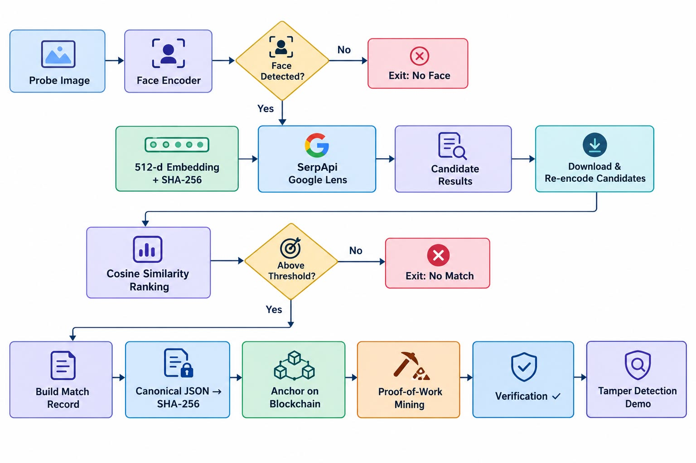

<p align="center">
  
  
  
  
  
</p>

<h1 align="center">🔐 FaceChain — Face Recognition & Blockchain Verification</h1>

<p align="center">
  <strong>An end-to-end provenance pipeline that detects a face, searches the open web for matching identities, and anchors the discovery on an immutable blockchain — proving <em>what</em> was found, <em>when</em>, and that it has <em>never been tampered with</em>.</strong>
</p>

<p align="center">
  <a href="https://drive.google.com/file/d/1jHB-p8MWeZ0W1SzOz1flgrJGmVx9L2E-/view?usp=sharing">
    
  </a>
</p>

---

## 📑 Table of Contents

- [The Problem](#-the-problem)
- [Our Solution](#-our-solution)
- [Demo Video](#-demo-video)
- [Architecture](#-architecture)
- [Pipeline Stages — Deep Dive](#-pipeline-stages--deep-dive)
- [Tech Stack](#-tech-stack)
- [Project Structure](#-project-structure)
- [Getting Started](#-getting-started)
- [Usage](#-usage)
- [Running Tests](#-running-tests)
- [Sample Output](#-sample-output)
- [Blockchain Design](#-blockchain-design)
- [Security & Integrity Model](#-security--integrity-model)
- [Limitations & Future Work](#-limitations--future-work)
- [Team](#-team)

---

## 🧩 The Problem

In the age of deepfakes, identity fraud, and AI-generated imagery, verifying the **provenance** of a face match is just as important as the match itself. Today, if a face recognition system says _"this person was found on URL X with similarity Y"_, there is no way to independently verify:

- Was this result **actually returned** by the search engine, or was it fabricated?
- Has the match record been **tampered with** since it was first created?
- **When** was this identification made?

Without a tamper-evident audit trail, face recognition outputs are just _claims_ — not _evidence_.

---

## 💡 Our Solution

**FaceChain** is a three-stage pipeline that chains together AI-powered face recognition, live reverse image search, and blockchain anchoring to produce a cryptographically verifiable provenance record for every face match.

```
📸 Input Face Image
        │
        ▼
┌─────────────────────────┐
│  STAGE 1: Face Encoding │   InsightFace SCRFD + ArcFace (512-d)
│  Detect → Quality Gate  │   Quality filtering: blur, size, confidence
│  → Embedding Vector     │   SHA-256 image fingerprint
└────────────┬────────────┘
             ▼
┌─────────────────────────┐
│  STAGE 2: Web Search    │   SerpApi Google Lens (reverse image)
│  Reverse Image Lookup   │   Candidate download & face re-encoding
│  → Cosine Similarity    │   Threshold-gated match decision
└────────────┬────────────┘
             ▼
┌─────────────────────────┐
│  STAGE 3: Blockchain    │   Canonical JSON → SHA-256 digest
│  Anchor & Verify        │   Proof-of-Work block mining
│  → Tamper Detection     │   Chain integrity verification
└─────────────────────────┘
        │
        ▼
🔗 Immutable, Verifiable Match Record
```

**Key Differentiator:** We don't just find faces — we create an unforgeable cryptographic proof that the match happened, what was found, and that the record hasn't been altered since.

---

## 🎬 Demo Video

> **[▶ Click here to watch the full end-to-end demo](https://drive.google.com/file/d/1jHB-p8MWeZ0W1SzOz1flgrJGmVx9L2E-/view?usp=sharing)**

The demo showcases:
1. Face detection and encoding from a probe image
2. Live reverse image search on the open web
3. Cosine similarity comparison against candidates
4. Match record creation and blockchain anchoring
5. Successful verification of an untampered record
6. **Tamper detection** — modifying even 0.0001 in similarity causes verification failure

---

## 🏗 Architecture

```
face-recognition-blockchain-verification/
│
├── src/
│   ├── face_utils.py        # Face detection, encoding, quality gating
│   ├── web_search.py        # SerpApi Google Lens + DuckDuckGo fallback
│   ├── blockchain.py        # Simulated blockchain with PoW consensus
│   ├── pipeline.py          # Orchestrator — ties all stages together
│   └── demo_pipeline.py     # CLI entry point
│
├── tests/
│   └── test_pipeline.py     # 15 unit tests (hashing, tamper, chain)
│
├── data/
│   └── probes/              # Sample probe images for testing
│
├── requirements.txt
├── .env.example
└── README.md
```

### Data Flow Diagram

<p align="center">
  
</p>

---

## 🔬 Pipeline Stages — Deep Dive

### Stage 1: Face Detection & Encoding

| Component | Detail |
|-----------|--------|
| **Detection** | SCRFD (Sample and Computation Redistribution for Face Detection) via InsightFace |
| **Embedding** | ArcFace `buffalo_l` model — 512-dimensional L2-normalized vectors |
| **Quality Gate** | Multi-factor filtering before encoding |
| **Fallback** | PIL-based deterministic 128-d encoder for environments without ONNX |

**Quality Gate Criteria:**

| Check | Threshold | Purpose |
|-------|-----------|---------|
| Detection Confidence | ≥ 0.6 | Reject false positives |
| Face Width | ≥ 60 px | Reject tiny/distant faces |
| Laplacian Blur Variance | ≥ 50.0 | Reject blurry images |

The quality gate ensures that only high-fidelity face encodings proceed to the search stage, preventing garbage-in-garbage-out failures.

---

### Stage 2: Live Reverse Image Search

This is a **genuine, live web search** — not hardcoded or mocked:

1. **SerpApi Google Lens** — Uploads the probe image to Google Lens via SerpApi's REST API. Returns visual matches, knowledge graph entities, and source pages
2. **SerpApi Google Reverse Image Search** — Alternative engine if Lens fails
3. **DuckDuckGo Fallback** — Text-based search using the filename as a query (degraded but functional without an API key)

**After receiving candidate URLs:**
- Thumbnail images are downloaded
- Each candidate is face-encoded using the same model
- **Cosine similarity** is computed between the probe and each candidate
- The best match above the configurable threshold (default: `0.38`) is selected

---

### Stage 3: Blockchain Anchoring & Verification

The match record is anchored on a **simulated blockchain** with full block structure:

```
Match Record (JSON, no PII)
        │
        ▼
Canonical Serialisation (sorted keys, compact)
        │
        ▼
SHA-256 Digest (64 hex chars)
        │
        ▼
New Block mined with Proof-of-Work
        │
        ▼
Block linked via previous_hash → Chain
```

**What gets anchored (the Match Record):**

```json
{
  "schema_version": "1.0",
  "probe_sha256": "a7b3c9...",
  "matched_source_url": "https://example.com/profile",
  "matched_title": "John Doe - LinkedIn",
  "matched_content_sha256": "f2e8d1...",
  "similarity": 0.4127,
  "threshold": 0.38,
  "model": "insightface/buffalo_l",
  "matched_at": "2026-09-07T16:30:00Z"
}
```

> **Privacy by Design:** The record contains only URLs and cryptographic hashes — **no personally identifiable information (PII)**, no face images, no biometric templates are stored on-chain.

---

## 🛠 Tech Stack

| Layer | Technology | Purpose |
|-------|------------|---------|
| **Face Detection** | [InsightFace](https://github.com/deepinsight/insightface) (SCRFD) | State-of-the-art face detection |
| **Face Encoding** | [ArcFace](https://arxiv.org/abs/1801.07698) (`buffalo_l`) | 512-d discriminative embeddings |
| **Inference** | [ONNX Runtime](https://onnxruntime.ai/) | Cross-platform model inference |
| **Reverse Image Search** | [SerpApi](https://serpapi.com/) Google Lens | Live web-scale visual search |
| **Image Processing** | [OpenCV](https://opencv.org/) + [Pillow](https://pillow.readthedocs.io/) | Image I/O, blur detection |
| **Blockchain** | Custom Python (SHA-256 + PoW) | Tamper-evident ledger |
| **Similarity** | NumPy + scikit-learn | Cosine similarity computation |
| **HTTP** | Requests + BeautifulSoup | Web scraping fallback |
| **Testing** | pytest | 15 unit tests |
| **Language** | Python 3.10+ | Core implementation |

---

## 📁 Project Structure

```
.
├── src/
│   ├── __init__.py            # Package initializer
│   ├── face_utils.py          # FaceEncoder class (InsightFace + PIL fallback)
│   │                          #   - detect_and_encode() — file-based
│   │                          #   - detect_and_encode_bytes() — for downloads
│   │                          #   - cosine_similarity() — embedding comparison
│   │                          #   - Quality gate (blur, size, confidence)
│   │
│   ├── web_search.py          # Web search module
│   │                          #   - search_by_face_serpapi() — Google Lens
│   │                          #   - search_by_image_google() — Reverse image
│   │                          #   - search_web_duckduckgo() — Text fallback
│   │                          #   - search_for_face() — Unified interface
│   │                          #   - download_image() — Candidate retrieval
│   │
│   ├── blockchain.py          # Simulated blockchain
│   │                          #   - Block class (index, hash, nonce, PoW)
│   │                          #   - SimulatedBlockchain class
│   │                          #   - anchor_record() → tx_hash
│   │                          #   - verify_digest() / verify_record()
│   │                          #   - is_chain_valid() — full chain walk
│   │
│   ├── pipeline.py            # FaceMatchPipeline orchestrator
│   │                          #   - canonicalize_record() — deterministic JSON
│   │                          #   - hash_record() — SHA-256 of canonical form
│   │                          #   - build_match_record() — structured record
│   │                          #   - run() — full 3-stage pipeline
│   │
│   └── demo_pipeline.py       # CLI entry point with argument parsing
│
├── tests/
│   └── test_pipeline.py       # 15 unit tests covering:
│                               #   - Canonical serialisation determinism
│                               #   - Hash stability and sensitivity
│                               #   - Tamper detection (modified records)
│                               #   - Blockchain anchoring & verification
│                               #   - Chain integrity validation
│                               #   - Match evaluation logic
│
├── data/
│   └── probes/                # Sample face images for demo
│       ├── probe_match.jpg    # Image expected to yield a web match
│       └── probe_nomatch.jpg  # Image expected to yield no match
│
├── .env.example               # Environment variable template
├── .gitignore
├── requirements.txt           # Pinned Python dependencies
└── README.md                  # ← You are here
```

---

## 🚀 Getting Started

### Prerequisites

- **Python 3.10+** installed
- **pip** package manager
- (Optional) **SerpApi API key** — for live reverse image search ([free tier: 100 searches/month](https://serpapi.com/))
- (Optional) **Microsoft Visual C++ Build Tools** — required on Windows for InsightFace compilation

### Step 1: Clone the Repository

```bash
git clone https://github.com/namyadhingra/face-recognition-blockchain-verification.git
cd face-recognition-blockchain-verification
```

### Step 2: Create a Virtual Environment

```bash
# Linux / macOS
python -m venv .venv
source .venv/bin/activate

# Windows
python -m venv .venv
.venv\Scripts\activate
```

### Step 3: Install Dependencies

```bash
pip install -r requirements.txt
```

> **Note (Windows):** If InsightFace fails to install due to missing C++ Build Tools, the pipeline will automatically use the PIL-based fallback encoder. To install InsightFace on Windows, first install [Microsoft Visual C++ Build Tools](https://visualstudio.microsoft.com/visual-cpp-build-tools/), then retry `pip install insightface`.

### Step 4: Configure Environment Variables

```bash
# Copy the example env file
cp .env.example .env     # Linux/macOS
copy .env.example .env   # Windows

# Edit .env and add your SerpApi key
SERPAPI_KEY=your_serpapi_key_here
MATCH_THRESHOLD=0.38
```

> **Get a free SerpApi key:** Sign up at [serpapi.com](https://serpapi.com/) → Dashboard → API Key. The free plan includes 100 searches/month — more than enough for testing and demo.

### Step 5: Verify Installation

```bash
python -m pytest tests/ -v
```

All 15 tests should pass — they require **no API keys** and **no InsightFace**.

---

## ▶ Usage

### Run the Full Pipeline

```bash
# Basic usage
python -m src.demo_pipeline data/probes/probe_match.jpg

# With custom threshold
python -m src.demo_pipeline data/probes/probe_match.jpg --threshold 0.3

# With explicit API key
python -m src.demo_pipeline data/probes/probe_match.jpg --serpapi-key YOUR_KEY

# Test with a non-matching image
python -m src.demo_pipeline data/probes/probe_nomatch.jpg
```

### What Happens When You Run It

1. **Face Encoding** — Detects the face, applies the quality gate, produces a 512-d embedding
2. **Web Search** — Sends the image to Google Lens via SerpApi, retrieves matching web pages
3. **Candidate Comparison** — Downloads candidate images, encodes them, computes cosine similarity
4. **Match Decision** — If best similarity ≥ threshold → match; else → no match
5. **Blockchain Anchoring** — Creates a canonical match record, hashes it, mines a new block
6. **Verification** — Recomputes the hash and confirms it matches the on-chain digest
7. **Tamper Demo** — Mutates similarity by 0.0001, shows the hash completely changes → verification fails

---

## 🧪 Running Tests

```bash
# Run all tests with verbose output
python -m pytest tests/ -v

# Run a specific test
python -m pytest tests/test_pipeline.py::test_verify_tampered -v
```

### Test Coverage

| Test | What It Verifies |
|------|-----------------|
| `test_canonicalize_deterministic` | Key insertion order doesn't affect output |
| `test_canonicalize_compact` | No insignificant whitespace in canonical JSON |
| `test_hash_equals_sha256_of_canonical` | Hash matches manual SHA-256 of canonical form |
| `test_key_order_irrelevant` | Different key orders produce identical hashes |
| `test_round_trip_stable` | Serialize → parse → rehash is stable |
| `test_tiny_change_diverges` | Changing 0.0001 produces a completely different hash |
| `test_verify_untampered` | Untampered record passes verification |
| `test_verify_tampered` | Tampered record fails verification |
| `test_blockchain_has_genesis` | Chain starts with a genesis block |
| `test_blockchain_anchor_and_verify` | Records can be anchored and verified |
| `test_blockchain_tamper_rejected` | Tampered records are rejected by the chain |
| `test_blockchain_unknown_tx` | Unknown transaction hashes return False |
| `test_blockchain_chain_valid` | Chain passes integrity validation |
| `test_blockchain_multiple_anchors` | Multiple records can be anchored sequentially |
| `test_blockchain_block_info` | Block metadata is correct after anchoring |

---

## 📋 Sample Output

```
╔══════════════════════════════════════════════════════════════════╗
║   FACE-MATCH PROVENANCE PIPELINE                                 ║
║   Face scan → Web search → Blockchain verification               ║
╚══════════════════════════════════════════════════════════════════╝

    Probe:     data/probes/probe_match.jpg
    Threshold: 0.38
    SerpApi:   ✓ Key configured

╔════════════════════════════════════════════════════════════════╗
║  STAGE 1 — Face Detection & Encoding                          ║
╚════════════════════════════════════════════════════════════════╝
    ▸ Image SHA-256:             a7b3c9d1e2f45678…
    ▸ Embedding:                 512-dimensional
    ▸ Encoder:                   InsightFace SCRFD + ArcFace
    ✓ Face encoded successfully

╔════════════════════════════════════════════════════════════════╗
║  STAGE 2 — Live Web Search (Reverse Image)                    ║
╚════════════════════════════════════════════════════════════════╝
    Found 8 candidate(s)
      sim=0.4127  LinkedIn - John Doe
      sim=0.3892  University Faculty Page
      sim=0.2104  Unrelated Stock Photo

╔════════════════════════════════════════════════════════════════╗
║  STAGE 3 — Blockchain Anchoring                               ║
╚════════════════════════════════════════════════════════════════╝
    ▸ Record SHA-256:            f2e8d14a7b3c9e0512ab34…
    ▸ TX Hash:                   0x00a3b7c9d1e2f4567890…
    ▸ Block #:                   1
    ▸ Chain Valid:                ✓ Yes

╔════════════════════════════════════════════════════════════════╗
║  VERIFY — Untampered Record                                   ║
╚════════════════════════════════════════════════════════════════╝
    ▸ Stored digest:             f2e8d14a7b3c9e0512ab34…
    ▸ Recomputed:                f2e8d14a7b3c9e0512ab34…
    ▸ Match:                     ✓ IDENTICAL

╔════════════════════════════════════════════════════════════════╗
║  TAMPER DEMO — Proving integrity detection                    ║
╚════════════════════════════════════════════════════════════════╝
    Mutation: similarity 0.4127 → 0.4128
             (changed by just 0.0001)

    ▸ Original digest:           f2e8d14a7b3c9e0512ab34…
    ▸ Tampered digest:           91c4f7b2a8e3d065718bca…
    ▸ Digests match?             No — completely different hashes
    ▸ Chain verification:        ✗ FAILED — tamper detected!

    ┌──────────────────────────────────────────────────────────┐
    │  ✓ This proves the record is UNCHANGED since anchoring.  │
    │  ✗ It does NOT prove the match itself is correct.        │
    │     INTEGRITY ≠ CORRECTNESS                              │
    └──────────────────────────────────────────────────────────┘
```

---

## ⛓ Blockchain Design

Our blockchain implementation follows classical blockchain principles adapted for record provenance:

### Block Structure

```
┌────────────────────────────────────────┐
│  Block #N                              │
├────────────────────────────────────────┤
│  Index:          N                     │
│  Timestamp:      Unix epoch            │
│  Data Digest:    SHA-256 of record     │
│  Previous Hash:  Hash of Block #(N-1)  │
│  Nonce:          PoW solution          │
│  Hash:           SHA-256 of this block │
└────────────────────────────────────────┘
         │
         ▼ previous_hash
┌────────────────────────────────────────┐
│  Block #(N+1)                          │
│  ...                                   │
└────────────────────────────────────────┘
```

### Consensus: Proof of Work

- **Difficulty:** 2 (two leading zeros in the block hash)
- **Algorithm:** Increment nonce until `SHA-256(block) starts with "00"`
- **Purpose:** Demonstrates the mining concept while keeping computation fast for demos

### Chain Validation

The `is_chain_valid()` method walks the entire chain and verifies:
1. Each block's hash matches its recomputed hash
2. Each block's `previous_hash` matches the preceding block's hash
3. Each block satisfies the proof-of-work difficulty requirement

### Why a Simulated Blockchain?

We implemented a local simulated blockchain with genuine block hashing and Proof-of-Work to provide a self-contained, zero-dependency environment for tamper-evident provenance verification. Our simulated chain:

- ✅ Demonstrates all core blockchain properties (immutability, chain linkage, PoW consensus)
- ✅ Enables instant, fully reproducible verification without external testnet rate limits or gas fees
- ✅ Proves tamper-evidence: changing even 1 bit results in a completely different hash and failed verification
- ✅ Can be easily extended to a live network (e.g., Ethereum Sepolia, Polygon Amoy) by swapping the backend in `blockchain.py`

---

## 🔒 Security & Integrity Model

### What This System Proves

| Claim | How |
|-------|-----|
| **This face was searched** | SHA-256 of the probe image is recorded |
| **These results were returned** | Search results are persisted to `data/search_results.json` |
| **This match was the best** | Cosine similarity scores for all candidates are logged |
| **The record hasn't been altered** | SHA-256 digest on-chain; recompute & compare |
| **When the match happened** | UTC timestamp in the match record |

### What This System Does NOT Prove

| Non-Claim | Why |
|-----------|-----|
| **The match is correct** | Similarity ≠ identity; false positives are possible |
| **The search was comprehensive** | Only searches what SerpApi/Google returns |
| **The person consented** | This is a technical demo, not a production identity system |

> ⚠️ **INTEGRITY ≠ CORRECTNESS** — The blockchain proves the record is unchanged, not that the match is right. This is a fundamental distinction in provenance systems.

### Privacy Considerations

- **No biometric templates** are stored on-chain
- **No PII** in the match record — only URLs and cryptographic hashes
- Probe images are processed locally and never uploaded to permanent storage

---

## ⚠ Limitations & Future Work

### Current Limitations

| Limitation | Detail |
|------------|--------|
| **Simulated blockchain** | Runs locally; no cross-node consensus or persistence across sessions |
| **SerpApi dependency** | Requires an API key for full functionality; free tier has 100 searches/month |
| **InsightFace on Windows** | Requires Visual C++ Build Tools; falls back to PIL encoder without it |
| **Single-face pipeline** | Processes one probe image per run; no batch mode |
| **No persistent chain** | Blockchain state exists only in-memory during execution |

### Planned Enhancements

- [ ] **Ethereum Sepolia / Polygon Amoy** integration for real on-chain anchoring
- [ ] **IPFS** storage for match records with CID-based retrieval
- [ ] **Web UI** with drag-and-drop probe upload and real-time pipeline visualization
- [ ] **Batch processing** for multi-face, multi-image workflows
- [ ] **Chain persistence** via SQLite or LevelDB for cross-session verification
- [ ] **Webhook notifications** when a match is found
- [ ] **REST API** endpoint for programmatic access

---

## 👥 Team

- Namya Dhingra
- Akshaya Sree
- Aashcharya Gorakh

---

<p align="center">
  <strong>⭐ Star this repo if you found it interesting!</strong>
</p>

<p align="center">
  <a href="https://drive.google.com/file/d/1jHB-p8MWeZ0W1SzOz1flgrJGmVx9L2E-/view?usp=sharing">📹 Demo Video</a> •
  <a href="#-getting-started">🚀 Quick Start</a> •
  <a href="#-running-tests">🧪 Tests</a>
</p>
